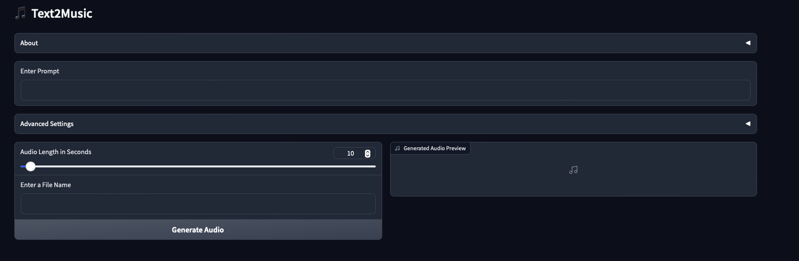

# 🎶 Text2Music - A simple text to music app using Python

This is a simple text to music app written in Python. It uses [MusicLDM](https://huggingface.co/docs/diffusers/main/en/api/pipelines/musicldm) to generate music from text. To build the web app, I used [Gradio](https://www.gradio.app). The app is mainly done for my personal use, but I thought it would be nice to share it with others.

## 📝 Features

- Generate any type of music from text
- Save the generated music as a WAV file
- Very fast interference even on CPU (tested on Apple M1, MPS is supported)

## 📷 Screenshots

## 🏗️ Installation

1. Clone this repository
2. Move to the cloned repository: `cd text2music`
3. Create a new Python 3.11 virtual environment in your preferred way and activate it
4. Install the requirements: `pip install -r requirements.txt`
5. Run the app: `python app.py`